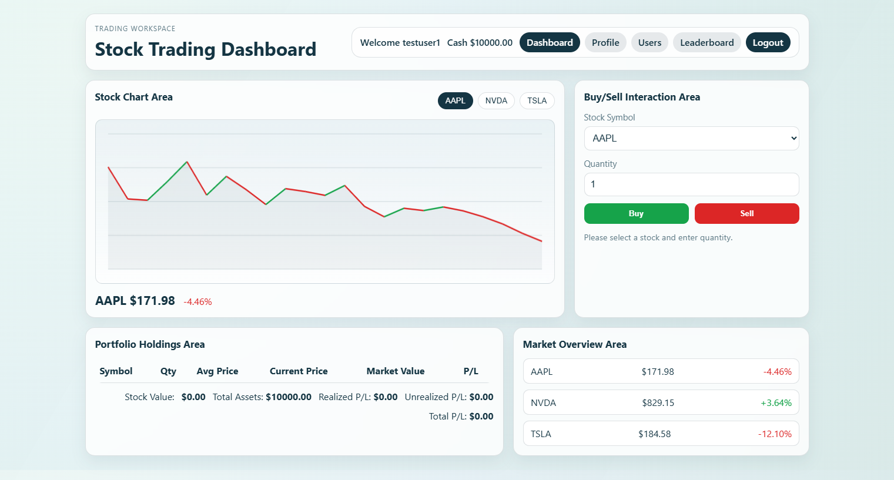
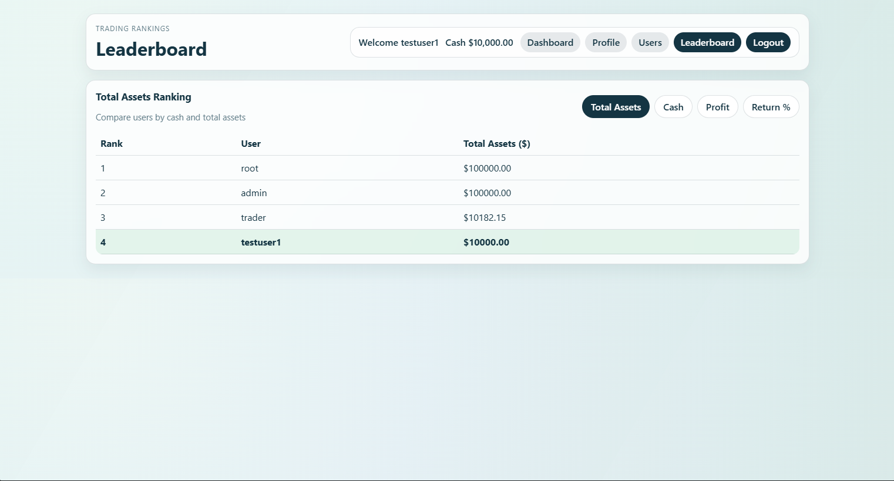
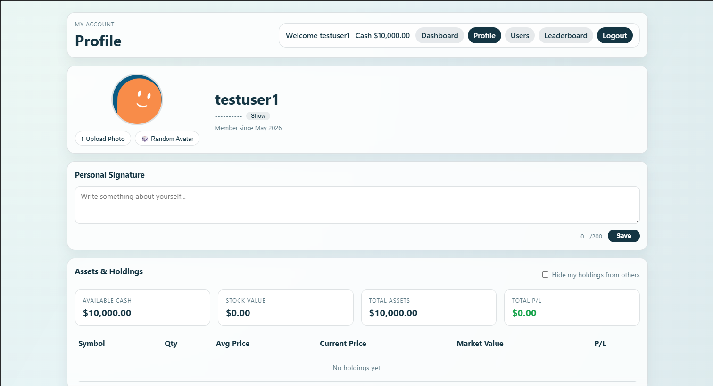
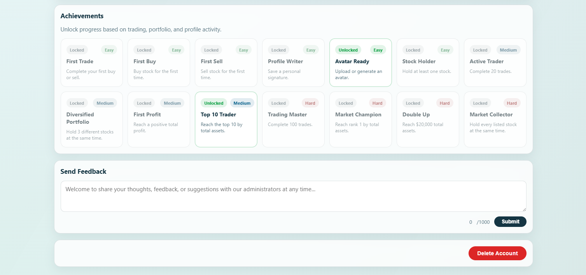

# CITS5505 Stock Trading Simulator
CITS5505 Agile Web Development — Semester 1, 2026

---

## 1. Application Purpose, Technology Stack, Design and Usage

### Purpose

A browser-based simulated stock trading platform where users start with **$10,000 virtual cash** and trade against a live-updating market. The goal is to grow your portfolio, climb the leaderboard, and unlock achievements — without any real financial risk.

### Design

The application is built with a **Flask** backend and a vanilla JavaScript frontend, using **SQLite** as the database managed through **Flask-Migrate**.

**Key features:**

| Feature | Description |
|---|---|
| Authentication | Register, login, logout, and password reset via email verification |
| Live Stock Market | Prices update every 2 seconds using a GBM-based simulation with momentum, mean reversion, and trade impact |
| Trading | Buy and sell stocks; portfolio tracks quantity, average cost, market value, and P&L |
| Leaderboard | Rank all users by cash, total assets, profit, or return percentage |
| Profile | Upload or generate an avatar, write a personal bio, toggle holdings visibility |
| Public Profiles | View any user's profile and portfolio (if not hidden) |
| Achievements | 14 unlockable achievements across easy / medium / hard tiers |
| Feedback | Submit feedback from the profile page; admins can view all submissions |
| Admin Panel | Manage users and stocks, view system stats and user feedback |

## Technology Stack

| Layer | Technologies |
|---|---|
| Backend | Flask, Flask-Login, Flask-WTF, Flask-Migrate |
| Frontend | HTML, CSS, Vanilla JavaScript |
| Database | SQLite, SQLAlchemy |
| Testing | Pytest, Selenium |
| Authentication | Session-based authentication with Flask-Login |
| Email Service | Resend API |
| Deployment Tools | Python virtual environment |

### Usage

After logging in, users land on the **Dashboard** where they can:
- Monitor real-time stock prices and charts
- Buy or sell stocks via the trading panel
- Track their portfolio summary (cash, stock value, total assets, P&L)
- View their transaction history

From the navigation bar, users can access the **Leaderboard**, **Users** directory, and their own **Profile**.

Administrators additionally have access to the **Admin Panel** at `/admin`, where they can add stocks, manage user roles, and read submitted feedback.

---

## 2. Group Members

| UWA ID | Name | GitHub Username |
|---|---|---|
| 24389925 | Zerun Zhang | [ElliotZhangzr](https://github.com/ElliotZhangzr) |
| 24807169 | Dilani Gunathilaka Mapitigamage | [Dilani1997](https://github.com/Dilani1997) |
| 24746589 | Weishan Li | [Weishan-Li](https://github.com/Weishan-Li) |
| 23685578 | Kushagra Patel | [kp240800](https://github.com/kp240800) |

---

## 3. Launch Instructions

### Prerequisites

- Python 3.11+
- Google Chrome (required for Selenium tests)

### Setup

**1. Clone the repository**
```bash
git clone https://github.com/ElliotZhangzr/CITS5505_project_1.git
cd CITS5505_project_1
```

**2. Create and activate a virtual environment**
```bash
python3 -m venv .venv
source .venv/bin/activate        # macOS / Linux
.venv\Scripts\activate           # Windows
```

**3. Install dependencies**
```bash
pip install -r requirements.txt
```

**4. Configure environment variables**

Create a `.env` file in the project root:
```
SECRET_KEY=your-secret-key-here
RESEND_API_KEY=your-resend-api-key
RESEND_FROM_EMAIL=noreply@yourdomain.com
```

> Password reset emails require a valid [Resend](https://resend.com) API key. The rest of the application works without it.

**5. Initialise the database**
```bash
flask db upgrade
```

**6. (Optional) Load seed data**
```bash
python seed_data.py
```

This creates three accounts:

| Username | Password | Role |
|---|---|---|
| `root` | `root` | Admin |
| `admin` | `Admin123` | Admin |
| `trader` | `Trader123` | User |

**7. Start the application**
```bash
python app.py
```

Open [http://127.0.0.1:5001](http://127.0.0.1:5001) in your browser.

---

## 4. Test Instructions

### Unit Tests

Run all unit tests with:
```bash
python run_unit_tests.py
```

Or using pytest directly:
```bash
pytest tests/unit/
```

Covers: authentication forms, trading service, portfolio logic, leaderboard, profile, admin logic, seed data, stock simulator, user service, and password reset service.

### Selenium Tests

Selenium tests require the Flask server to be running first.

**Terminal 1 — start the server:**
```bash
python app.py
```

**Terminal 2 — run Selenium tests:**
```bash
pytest tests/selenium/
```

Covers: login/logout, registration, dashboard, leaderboard, and admin pages.

> Chrome and `chromedriver` are managed automatically via `webdriver-manager`.

## Security Features

- Password hashing using Werkzeug
- CSRF protection using Flask-WTF
- Session-based authentication with Flask-Login
- Role-based admin access control
- Secure password reset tokens
- Backend validation for profile and trading forms

## Achievement System

Users unlock achievements by reaching trading milestones such as:
- Completing first trade
- Reaching profit targets
- Maintaining high portfolio value
- Active trading participation

Achievements are grouped into:
- Easy
- Medium
- Hard

## Screenshots

### Dashboard


### Leaderboard


### Profile Page

